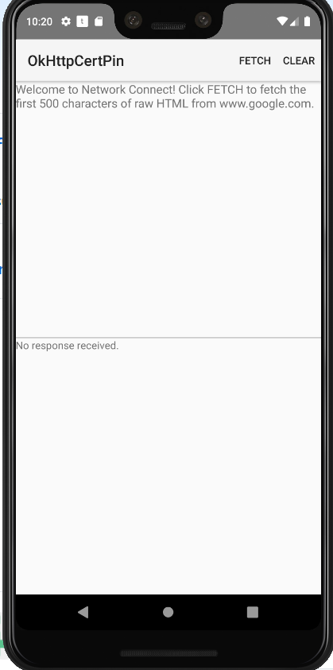

Android OkHttpCertPin Sample
===================================

This sample demonstrates how to use certificate pinning using OkHttp Library.

Introduction
------------

This sample demonstrates how to use certificate pinning using OkHttp Library
[`CertificatePinner`][4]. OkHttp is an external library and should be added to
the project.
The code would test the pinning with/without a valid certificate. The certificate
is placed in res\raw directory. The pin is automatically generated from the certficate.
For failure test, a random pin is set for the CertificatePinner:

    new CertificatePinner.Builder()
    .add("frida.re", "sha256/9SLklscvzMYdgf+52lp5ze/hY0CFHyLSPQzSpYYIBm8=")
    .build())
    
Success test:

    new CertificatePinner.Builder()
    .add("frida.re",certPin) //certPin is loaded from the resource folder
    .build())

[1]: https://square.github.io/okhttp/https/

Pre-requisites
--------------

- Android SDK 28
- Android Build Tools v28.0.3
- Android Support Repository

Screenshots
-------------

 

Getting Started
---------------

This sample uses the Gradle build system. To build this project, use the
"gradlew build" command or use "Import Project" in Android Studio.
