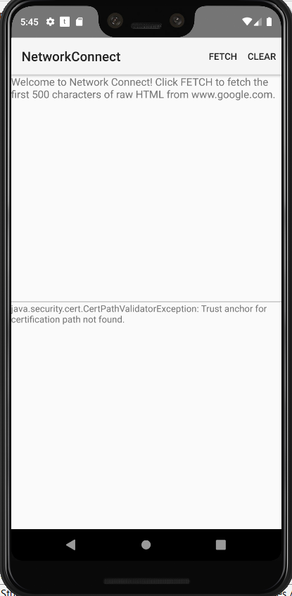

Android TrustManagerCertPin Sample
===================================

This sample demonstrates how use certificate pinning using TrustManager.

Introduction
------------

This sample demonstrates how use certificate pinning using TrustManager.
Although the algorithm is not performing pinning per se, its end result is effectively
similar to the pinning. This method is bit older than the other two, and hence the code
needs a bit more setup:

        private SSLContext get_initialized_SSLContext() throws KeyStoreException, CertificateException, NoSuchAlgorithmException, IOException, KeyManagementException {
            //int id = getResources().getIdentifier("frida", "raw","com.example.android.TrustManagerCertPin"); //change to this for testing failure
            int id = getResources().getIdentifier("badsslcert", "raw","com.example.android.TrustManagerCertPin");

            InputStream resourceStream = getResources().openRawResource(id);

            CertificateFactory cf = CertificateFactory.getInstance("X.509");
            Certificate ca = cf.generateCertificate(resourceStream);
            String keyStoreType = KeyStore.getDefaultType();
            KeyStore keyStore = KeyStore.getInstance(keyStoreType);
            keyStore.load(null, null);
            keyStore.setCertificateEntry("ca", ca);

            String trustManagerAlgorithm = TrustManagerFactory.getDefaultAlgorithm();
            TrustManagerFactory trustManagerFactory = TrustManagerFactory.getInstance(trustManagerAlgorithm);
            trustManagerFactory.init(keyStore);

            SSLContext sslContext = SSLContext.getInstance("TLS");
            sslContext.init(null,trustManagerFactory.getTrustManagers(),null);
            return sslContext;
        }
        
After preparing the SSLContext, it should be set for the connection instance:

            SSLContext sslContext = get_initialized_SSLContext();
            connection = (HttpsURLConnection) url.openConnection();
            connection.setSSLSocketFactory(sslContext.getSocketFactory());
            
Pre-requisites
--------------

- Android SDK 28
- Android Build Tools v28.0.3
- Android Support Repository

Screenshots
-------------

 

Getting Started
---------------

This sample uses the Gradle build system. To build this project, use the
"gradlew build" command or use "Import Project" in Android Studio.

